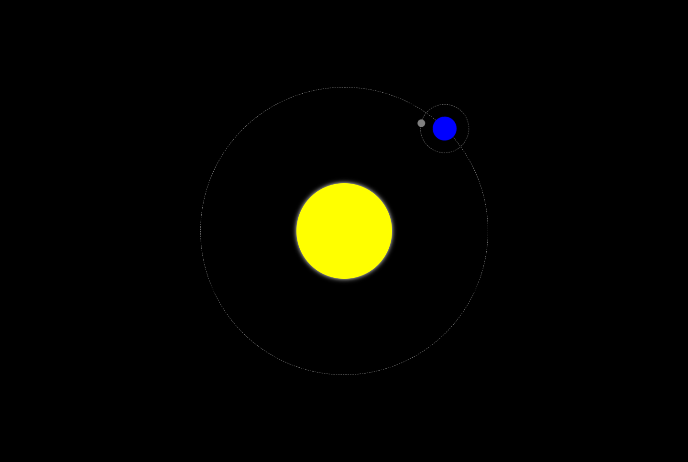

# XML Website
This project demonstrates that it is possible to create a small interactive website using XML instead of standard HTML or legacy XHTML.

Because XML is primarily used for data exchange and storage, and because it lacks many of the features of HTML, it should not be used to develop websites, even small ones.

The `xml-stylesheet` processing instruction is used to associate a CSS stylesheet with the XML document, thereby giving us access to all CSS features, including CSS animations and transitions.

Thanks to SVG elements, it is possible to add hyperlinks and run some JavaScript code.

## Screenshot

## Credits
Favicon made by [Md Tanvirul Haque](https://www.flaticon.com/authors/md-tanvirul-haque) from [www.flaticon.com](https://www.flaticon.com/)

## Copyright
© 2023 Johnny Gérard
